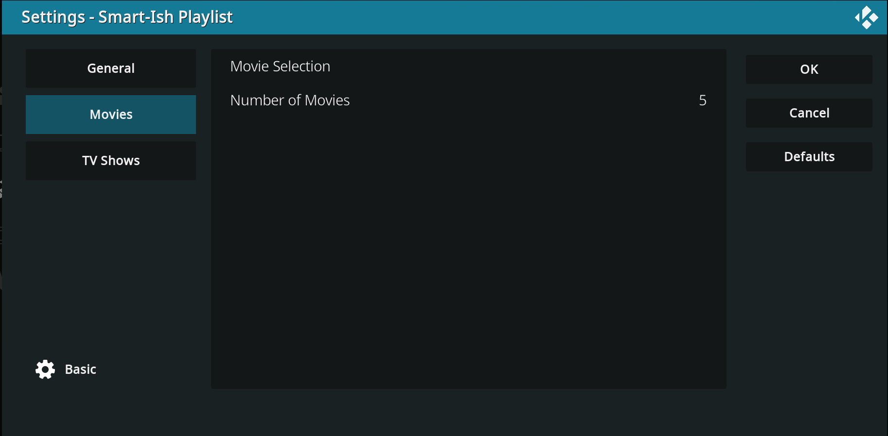
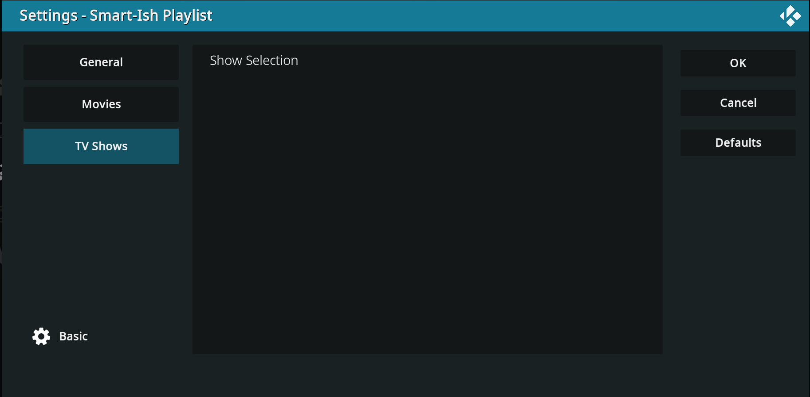

# Kodi Smart-Ish Playlist

---

A quick and dirty add-on for Kodi that builds a random playlist based on the media criteria provided for the script.

Can be run on demand or configured to run once at startup.

## General settings

---
- "Build At Startup" will generate the playlist upon starting Kodi.
- "Auto Play" and "Shuffle" to play and shuffle automatically once built.
- "Current Selections" display JSON data of the currently designated media.

## Movies

---

Select Movies from the list and designate how many should randomly be chosen from that selection.

## TV Shows

---

Select TV Shows, number of episodes for each show, and episodes to exclude from each show.
The menu dialog will request this information for each selected show.

[Download](https://github.com/calebyourison/kodi_smart_ish_playlist/releases/tag/kodi-smart-ish-playlist) and install from zip.

#### Disclaimer
---
This add-on is not part of the official repository and is not responsible for any issues that you encounter with your Kodi installation.
Please review the code if you are concerned that it may conflict with your existing system. 
This project assumes that you legally own any and all media in your library.  When in doubt, please consult applicable copyright laws.
