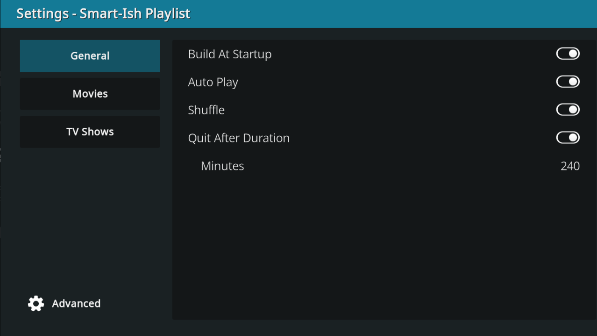
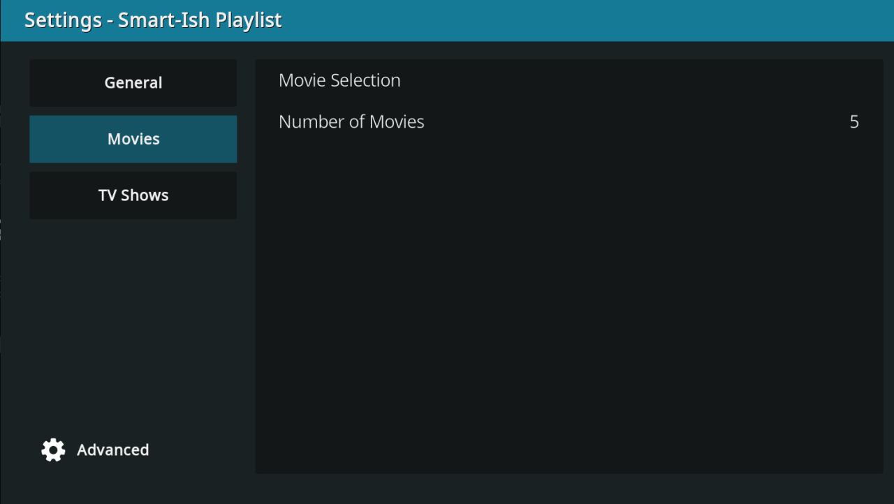
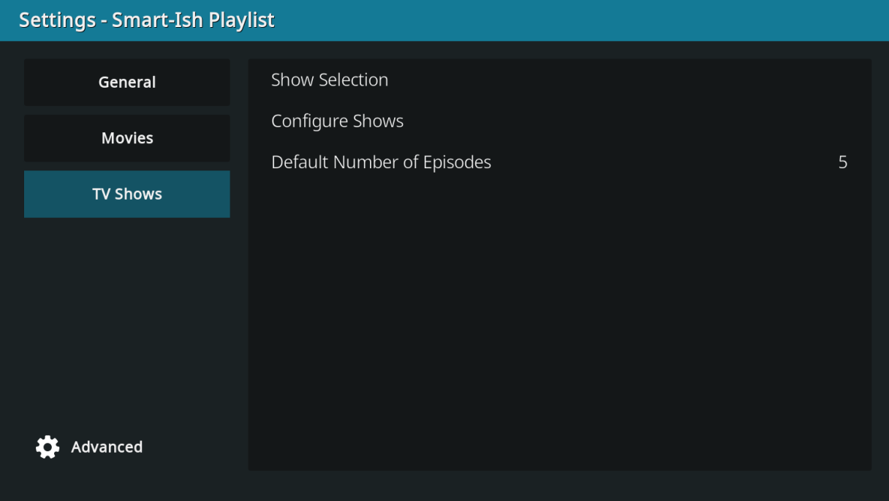

# Kodi Smart-Ish Playlist

---

A quick and dirty add-on for Kodi that builds a random playlist based on the media criteria provided..  
Currently, Movies and TV Shows are supported.
The playlist will include an arbitrary number of randomly selected movies from the given subset.
The playlist will also include randomly selected episodes from each designated show while allowing for exclusions of specific episodes.

Can be run on demand or configured to run once at startup.

[Download](https://github.com/calebyourison/kodi_smart_ish_playlist/releases/tag/kodi-smart-ish-playlist) and install from zip.

## General settings

---
- "Build At Startup" will generate the playlist upon starting Kodi.
- "Auto Play" and "Shuffle" to play and shuffle automatically once built.
- "Quit After Duration" will exit Kodi after the specified number of minutes.  Applicable only if Auto Play is enabled. For more advanced timers and settings, it's recommended to use [timers](https://github.com/Heckie75/kodi-addon-timers).

## Movies

---

Select Movies from the library and designate how many should randomly be chosen from that selection.

## TV Shows

---
- "Shows Selection" allows the selection of desired shows from the library.
- "Configure Shows" is optional. It allows configuration specific to each show. Currently, one can select the number of episodes as well as episodes to exclude.
- "Default Number of Episodes" will take effect for any shows that were selected, but not configured individually.

#### Disclaimer
---
This add-on is not part of the official repository and is not responsible for any issues that you encounter with your Kodi installation.
Please review the code if you are concerned that it may conflict with your existing system. 
This project assumes that you legally own any and all media in your library.  When in doubt, please consult applicable copyright laws.
