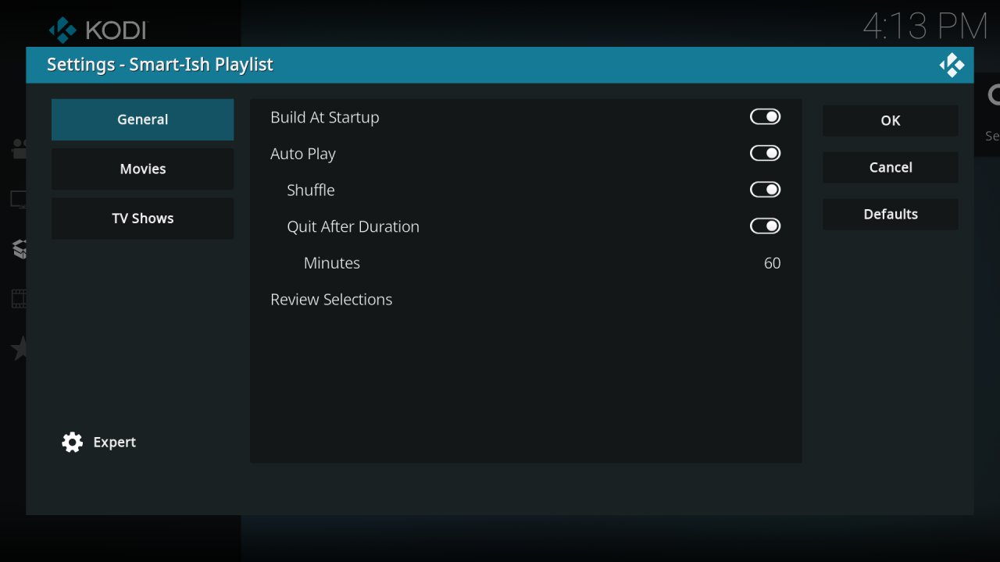
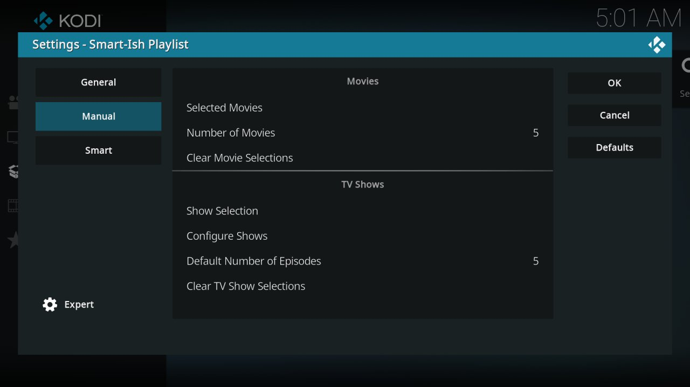
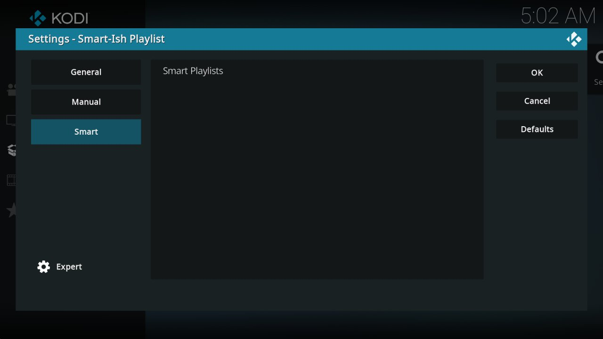

# Kodi Smart-Ish Playlist

---

A quick and dirty add-on for Kodi that builds a random Video playlist based on the media criteria provided.
Currently, two modes are supported: manual selection , and smart playlists.

For manual, the playlist will include an arbitrary number of randomly selected movies from the given subset.
The playlist will also include randomly selected episodes from each designated show while allowing for exclusions of specific episodes.

Smart mode will combine the user selected video playlists (.xsp) into a single large one.  
For smart playlists containing TV Shows, the add-on will attempt to locate movies linked to the series.  
If this is not desired, consider using an Episodes smart playlist instead.

Can be run on demand or configured to run once at startup.

This add-on has been tested on Kodi 21 using Ubuntu and Android. Performance on Android seems to vary based on hardware.

[Download](https://github.com/calebyourison/kodi_smart_ish_playlist/releases) and install from zip.

## General settings

---
- "Type" (Manual/Smart) will determine from which criteria to build the playlist.
- "Build At Startup" will generate the playlist upon starting Kodi.
- "Auto Play" and "Shuffle" to play and shuffle automatically once built.
- "Quit After Duration" will exit Kodi after the specified number of minutes.  Applicable only if Auto Play is enabled. For more advanced timers and settings, it's recommended to use [timers](https://github.com/Heckie75/kodi-addon-timers).
- "Review Selections" displays what the playlist will look like given the current selections (note the settings are saved on close, so it might be required to save and reopen to see updates)

## Manual

---

- Select Movies from the library and designate how many should randomly be chosen from that selection.
- "Shows Selection" allows the selection of desired shows from the library.
- "Configure Shows" is optional. It allows configuration specific to each show. Currently, one can select the number of episodes as well as episodes to exclude.
- "Default Number of Episodes" will take effect for any shows that were selected, but not configured individually.

## Smart

---

- Select multiple user defined smart playlists if desired.

#### Disclaimer
---
This add-on is not part of the official repository and is not responsible for any issues that you encounter with your Kodi installation.
Please review the code if you are concerned that it may conflict with your existing system. 
This project assumes that you legally own any and all media in your library.  When in doubt, please consult applicable copyright laws.
